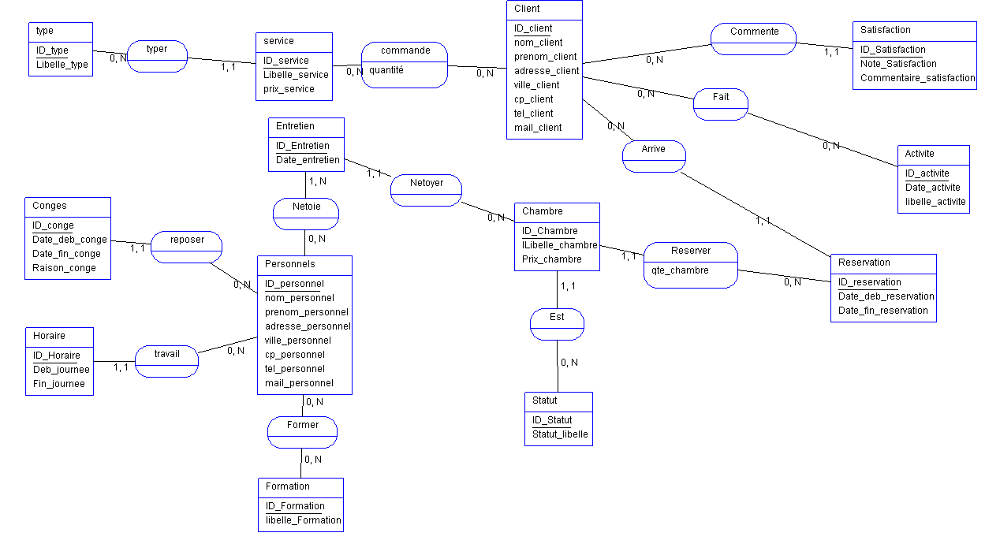

# Réponse projet Exament Final

Tous les fichiers .ASI sont disponnible dans ce dossier EXAMEN, Bonne journée !

## Dictionnaire de données :

Client

    - ID_client
    - nom_client
    - prenom_client
    - adresse_client
    - ville_client
    - cp_client (code postale)
    - tel_client
    - mail_client

Chambre

    - ID_Chambre
    - Libelle_chambre
    - Prix_chambre

Statut

    - ID_statut
    - Statut_libelle (Dispo / occupé)

Satisfaction

    - ID_satisfaction
    - Note_satisfaction (note/5)
    - Commentaire_satisfaction (commentaire du client)

Activite (activité du client pour son historique du voyage)

    - ID_activite
    - Date_activite
    - libelle_activite

Reservation

    - ID_reservation
    - Date_deb_reservation
    - Date_fin_reservation

Service

    - ID_service
    - Libelle_service
    - prix_service

Entretien

    - ID_entretiens
    - Date_Entretien

Personnels

    - ID_personnel
    - nom_personnel
    - prenom_personnel
    - adresse_personnel
    - ville_personnel
    - cp_personnel
    - tel_personnel
    - mail_personnel

Formation (formation du personnel)

    - ID_Formation
    - libelle_Formation

Type (type du service commmandé par le client)

    - ID_type
    - Libelle_type

Conges

    - ID_conge
    - Date_deb_conge
    - Date_fin_conge
    - Raison_conge

Horaire

    - ID_Horaire
    - Deb_journee (heure debut journee)
    - Fin_journee (heure de fin de journée)


## MCD :



## MLD :


## MPD :

Client (ID_client_Client, nom_client_Client, prenom_client_Client, adresse_client_Client, ville_client_Client, cp_client_Client, tel_client_Client, mail_client_Client)  

Chambre (ID_Chambre_Chambre, lLibelle_chambre_Chambre, Prix_chambre_Chambre, #ID_Statut_Statut)

Statut (ID_Statut_Statut, Statut_libelle_Statut)

Entretien (ID_Entretien_Entretien, Date_entretien_Entretien, #ID_Chambre_Chambre)  

service (ID_service_service, Libelle_service_service, prix_service_service, #ID_type_type)  

type (ID_type_type, Libelle_type_type)  

Personnels (ID_personnel_Personnels, nom_personnel_Personnels, prenom_personnel_Personnels, adresse_personnel_Personnels, ville_personnel_Personnels, cp_personnel_Personnels, tel_personnel_Personnels, mail_personnel_Personnels)  

Horaire (ID_Horaire_Horaire, Deb_journee_Horaire, Fin_journee_Horaire, #ID_personnel_Personnels)  

Activite (ID_activite, Date_activite_Historique, libelle_activite_Activite)  

Formation (ID_Formation_Formation, libelle_Formation_Formation)  

Conges (ID_conge_Conges, Date_deb_conge_Conges, Date_fin_conge_Conges, Raison_conge_Conges, #ID_personnel_Personnels) 

Satisfaction (ID_Satisfaction_Satisfaction, Note_Satisfaction_Satisfaction, Commentaire_satisfaction_Satisfaction, #ID_client_Client)  

Reservation (ID_reservation_Reservation, Date_deb_reservation, Date_fin_reservation_Reservation, #ID_client_Client)  

Former (ID_personnel_Personnels, ID_Formation_Formation)  

Reserver (ID_Chambre_Chambre, ID_reservation_Reservation, qte_chambre_Reserver)  

Fait (ID_client_Client, ID_activite)  

Netoie (ID_personnel_Personnels, ID_Entretien_Entretien)  

commande (ID_service_service, ID_client_Client, quantité_commande) 


## Code MySQL généré par AnalyseSI : 

```SQL
DROP TABLE IF EXISTS Client ; CREATE TABLE Client (ID_client_Client BIGINT AUTO_INCREMENT NOT NULL, nom_client_Client BIGINT, prenom_client_Client BIGINT, adresse_client_Client BIGINT, ville_client_Client BIGINT, cp_client_Client BIGINT, tel_client_Client BIGINT, mail_client_Client BIGINT, PRIMARY KEY (ID_client_Client)) ENGINE=InnoDB;


DROP TABLE IF EXISTS Chambre ; CREATE TABLE Chambre (ID_Chambre_Chambre BIGINT AUTO_INCREMENT NOT NULL, lLibelle_chambre_Chambre BIGINT, Prix_chambre_Chambre BIGINT, ID_Statut_Statut **NOT FOUND**, PRIMARY KEY (ID_Chambre_Chambre)) ENGINE=InnoDB; 


DROP TABLE IF EXISTS Statut ; CREATE TABLE Statut (ID_Statut_Statut BIGINT AUTO_INCREMENT NOT NULL, Statut_libelle_Statut BIGINT, PRIMARY KEY (ID_Statut_Statut)) ENGINE=InnoDB; 


DROP TABLE IF EXISTS Entretien ; CREATE TABLE Entretien (ID_Entretien_Entretien BIGINT AUTO_INCREMENT NOT NULL, Date_entretien_Entretien BIGINT, ID_Chambre_Chambre **NOT FOUND**, PRIMARY KEY (ID_Entretien_Entretien)) ENGINE=InnoDB;


DROP TABLE IF EXISTS service ; CREATE TABLE service (ID_service_service BIGINT AUTO_INCREMENT NOT NULL, Libelle_service_service BIGINT, prix_service_service BIGINT, ID_type_type **NOT FOUND**, PRIMARY KEY (ID_service_service)) ENGINE=InnoDB;


DROP TABLE IF EXISTS type ; CREATE TABLE type (ID_type_type BIGINT AUTO_INCREMENT NOT NULL, Libelle_type_type BIGINT, PRIMARY KEY (ID_type_type)) ENGINE=InnoDB;


DROP TABLE IF EXISTS Personnels ; CREATE TABLE Personnels (ID_personnel_Personnels BIGINT AUTO_INCREMENT NOT NULL, nom_personnel_Personnels BIGINT, prenom_personnel_Personnels BIGINT, adresse_personnel_Personnels BIGINT, ville_personnel_Personnels BIGINT, cp_personnel_Personnels BIGINT, tel_personnel_Personnels BIGINT, mail_personnel_Personnels BIGINT, PRIMARY KEY (ID_personnel_Personnels)) ENGINE=InnoDB;


DROP TABLE IF EXISTS Horaire ; CREATE TABLE Horaire (ID_Horaire_Horaire BIGINT AUTO_INCREMENT NOT NULL, Deb_journee_Horaire BIGINT, Fin_journee_Horaire BIGINT, ID_personnel_Personnels **NOT FOUND**, PRIMARY KEY (ID_Horaire_Horaire)) ENGINE=InnoDB;


DROP TABLE IF EXISTS Activite ; CREATE TABLE Activite (ID_activite BIGINT AUTO_INCREMENT NOT NULL, Date_activite_Historique BIGINT, libelle_activite_Activite BIGINT, PRIMARY KEY (ID_activite)) ENGINE=InnoDB;


DROP TABLE IF EXISTS Formation ; CREATE TABLE Formation (ID_Formation_Formation BIGINT AUTO_INCREMENT NOT NULL, libelle_Formation_Formation BIGINT, PRIMARY KEY (ID_Formation_Formation)) ENGINE=InnoDB;


DROP TABLE IF EXISTS Conges ; CREATE TABLE Conges (ID_conge_Conges BIGINT AUTO_INCREMENT NOT NULL, Date_deb_conge_Conges BIGINT, Date_fin_conge_Conges BIGINT, Raison_conge_Conges BIGINT, ID_personnel_Personnels **NOT FOUND**, PRIMARY KEY (ID_conge_Conges)) ENGINE=InnoDB;


DROP TABLE IF EXISTS Satisfaction ; CREATE TABLE Satisfaction (ID_Satisfaction_Satisfaction BIGINT AUTO_INCREMENT NOT NULL, Note_Satisfaction_Satisfaction BIGINT, Commentaire_satisfaction_Satisfaction BIGINT, ID_client_Client **NOT FOUND**, PRIMARY KEY (ID_Satisfaction_Satisfaction)) ENGINE=InnoDB;


DROP TABLE IF EXISTS Reservation ; CREATE TABLE Reservation (ID_reservation_Reservation BIGINT AUTO_INCREMENT NOT NULL, Date_deb_reservation BIGINT, Date_fin_reservation_Reservation BIGINT, ID_client_Client **NOT FOUND**, PRIMARY KEY (ID_reservation_Reservation)) ENGINE=InnoDB;


DROP TABLE IF EXISTS Former ; CREATE TABLE Former (ID_personnel_Personnels **NOT FOUND** AUTO_INCREMENT NOT NULL, ID_Formation_Formation **NOT FOUND** NOT NULL, PRIMARY KEY (ID_personnel_Personnels,  ID_Formation_Formation)) ENGINE=InnoDB;


DROP TABLE IF EXISTS Reserver ; CREATE TABLE Reserver (ID_Chambre_Chambre **NOT FOUND** AUTO_INCREMENT NOT NULL, ID_reservation_Reservation **NOT FOUND** NOT NULL, qte_chambre_Reserver BIGINT, PRIMARY KEY (ID_Chambre_Chambre,  ID_reservation_Reservation)) ENGINE=InnoDB;


DROP TABLE IF EXISTS Fait ; CREATE TABLE Fait (ID_client_Client **NOT FOUND** AUTO_INCREMENT NOT NULL, ID_activite **NOT FOUND** NOT NULL, PRIMARY KEY (ID_client_Client,  ID_activite)) ENGINE=InnoDB;


DROP TABLE IF EXISTS Netoie ; CREATE TABLE Netoie (ID_personnel_Personnels **NOT FOUND** AUTO_INCREMENT NOT NULL, ID_Entretien_Entretien **NOT FOUND** NOT NULL, PRIMARY KEY (ID_personnel_Personnels,  ID_Entretien_Entretien)) ENGINE=InnoDB;


DROP TABLE IF EXISTS commande ; CREATE TABLE commande (ID_service_service **NOT FOUND** AUTO_INCREMENT NOT NULL, ID_client_Client **NOT FOUND** NOT NULL, quantité_commande BIGINT, PRIMARY KEY (ID_service_service,  ID_client_Client)) ENGINE=InnoDB;


ALTER TABLE Chambre ADD CONSTRAINT FK_Chambre_ID_Statut_Statut FOREIGN KEY (ID_Statut_Statut) REFERENCES Statut (ID_Statut_Statut); ALTER TABLE Entretien ADD CONSTRAINT FK_Entretien_ID_Chambre_Chambre FOREIGN KEY (ID_Chambre_Chambre) REFERENCES Chambre (ID_Chambre_Chambre); ALTER TABLE service ADD CONSTRAINT FK_service_ID_type_type FOREIGN KEY (ID_type_type) REFERENCES type (ID_type_type); ALTER TABLE Horaire ADD CONSTRAINT FK_Horaire_ID_personnel_Personnels FOREIGN KEY (ID_personnel_Personnels) REFERENCES Personnels (ID_personnel_Personnels); ALTER TABLE Conges ADD CONSTRAINT FK_Conges_ID_personnel_Personnels FOREIGN KEY (ID_personnel_Personnels) REFERENCES Personnels (ID_personnel_Personnels); ALTER TABLE Satisfaction ADD CONSTRAINT FK_Satisfaction_ID_client_Client FOREIGN KEY (ID_client_Client) REFERENCES Client (ID_client_Client); ALTER TABLE Reservation ADD CONSTRAINT FK_Reservation_ID_client_Client FOREIGN KEY (ID_client_Client) REFERENCES Client (ID_client_Client); ALTER TABLE Former ADD CONSTRAINT FK_Former_ID_personnel_Personnels FOREIGN KEY (ID_personnel_Personnels) REFERENCES Personnels (ID_personnel_Personnels); ALTER TABLE Former ADD CONSTRAINT FK_Former_ID_Formation_Formation FOREIGN KEY (ID_Formation_Formation) REFERENCES Formation (ID_Formation_Formation); ALTER TABLE Reserver ADD CONSTRAINT FK_Reserver_ID_Chambre_Chambre FOREIGN KEY (ID_Chambre_Chambre) REFERENCES Chambre (ID_Chambre_Chambre); ALTER TABLE Reserver ADD CONSTRAINT FK_Reserver_ID_reservation_Reservation FOREIGN KEY (ID_reservation_Reservation) REFERENCES Reservation (ID_reservation_Reservation); ALTER TABLE Fait ADD CONSTRAINT FK_Fait_ID_client_Client FOREIGN KEY (ID_client_Client) REFERENCES Client (ID_client_Client); ALTER TABLE Fait ADD CONSTRAINT FK_Fait_ID_activite FOREIGN KEY (ID_activite) REFERENCES Activite (ID_activite); ALTER TABLE Netoie ADD CONSTRAINT FK_Netoie_ID_personnel_Personnels FOREIGN KEY (ID_personnel_Personnels) REFERENCES Personnels (ID_personnel_Personnels); ALTER TABLE Netoie ADD CONSTRAINT FK_Netoie_ID_Entretien_Entretien FOREIGN KEY (ID_Entretien_Entretien) REFERENCES Entretien (ID_Entretien_Entretien); ALTER TABLE commande ADD CONSTRAINT FK_commande_ID_service_service FOREIGN KEY (ID_service_service) REFERENCES service (ID_service_service); ALTER TABLE commande ADD CONSTRAINT FK_commande_ID_client_Client FOREIGN KEY (ID_client_Client) REFERENCES Client (ID_client_Client); 
```