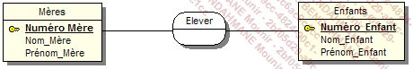

# Modélisation de données

## 1. Créer un dépot git :
- Ouvrir un terminal 
- taper :
```sh
git init
```
Cette commande va initialiser un dépot Git, Git va traquer toutes les modification.

## 2. Utiliser Git :

- Ajouter un fichier a mon dépot git
````sh
git add <fichier>
````
- Sauvegarder mon dépot
````sh
git commit -m "message de commit"
````

## 3. Merise :


Merise est une méthode de modélisation de données. Elle permet de représenter les données d'un système d'information.Merise est un acronyme de : Méthode d'Etude et de Réalisation Informatique pour les Systèmes d'Entrepryse.

#### Présentation générale :
Cette méthode se caracterise par trois points clés : 
- une approche dite systèmique : on transforme les processus de l'entreprise en système d'information 
- une séparation des données et des traitements
- une approche nivelée

    

Le systeme de pilotage : 
- il est composé de l'ensemble des acteurs qui vont **piloter** le système d'information  

le système d'information :
- il est composé de l'ensemble des acteurs qui vont **utiliser** le système d'information

Le système operant : 
- Il est composé de l'ensemble des acteurs qui vont **produire** les données du système d'information

### Séparation des données et des traitements 


La séparation des données et des traitements permet de séparer les données du système d'information et les traitements effectués sur ces données. 
Cette démarche se fait en 3 étapes :
- L'analyse des flux : on annalyse les flux de d'informations entre les acteurs du système d'information et les acteurs du système opérant
- L'étude des documents interne (factures, bon de livraison etc...)
- L'étude des documents externes (fournisseurs, clients etc...)


Les différents types d'informations : 

- les infos de bases ou élémentaires : ce sont les données de base du système d'information 
- les infos calculées : ce sont les données calculées a partir des données de base 
- les traitements ou les fonctions : ce sont les traitements effectués sur les données de base pour obtenir les données calculées 

**En Résumé :** vous devres identifier les données et les traitements efféctués sur ces derniers.

### l'approche nivelée

Pour effectuer la conception d'un SI, on va utiliser une approche nivelée. Cette approche se compose de 4 niveaux :

- le niveau conceptuel
- le niveau organisationnel
- le niveau logique 
- le niveau physique

#### **Le niveau conceptuel :**

Le niveau conceptuel permet de moéliser les données de l'entreprise. On va utiliser le modèle conceptuel de données MCD pour modéliser les données de l'entreprise, et le MCT pour modéliser les traitements effectués sur ces données.

#### **Le niveau organisationnel :**

Le niveau organisationnel va permettre d'integrer a l'analyse précédente toutes les notions de temporalité, de chronologie des opérations, de contrainte géographique. On va utilser le modele organisationnel des traitements "MOT" et le modèle organisationnel des données "MOD" pour modéliser les traitements de l'entreprise.

En resumé on se pose les questions suivantes a partir des données recueillies au niveau conceptuel :

- **Quand** les traitements sont-ils effectuées ?
- **Où** les traitements sont-ils effectuées ?
- Par **qui** les traitements sont-ils effectués ?

#### **Le niveau Logique**

Le niveau logique va permettre de modéliser les données de l'entreprise en utilisatn le modèle logique de données "MLD" et les traitements de l'entreprise en utilisant le modèle logique des traitement"MLT"

Le MLD et indépendant des languages de programmation et des SGBD 

On répond a la qjestion : **avec quoi** les traitements sont-ils effectuées

#### **Le niveau physique**

Il s'agit de l'organisation `réelle` des données. On va utiliser le modèles physiques de données "MPD" et le modèle physique des traitments "MPT". 

Ici, on apporte les solutions techniques de stockage des données.

On repond a la question: **Comment** les traitements sont-ils efféctuées ?

#### **Résumée des 4 niveaux**


### Des données aux dépendances fonctionnelles : 

Pour etre intégrées dans un système d'information , les données doivent être triées et organisées. On va souvent tenter de les classer par type de données : 

- chaines de caractères, format texte
- type alphanumérique, format texte
- le type numérique (intégrer, float...)
- le type date (date, datetime, timestamp)
- logique ou bouléen (true, false)

Création d'un dictionnaire de données :


<br>
### Les dépendances fonctionnelles 
<br>

Une Dépendances fonctionnelles est une relation entre deux awttributs d'une table. Elle permet de definir une relation de dépendance entre deux attributs d'une table.

Le role d'une dépendance fonctionnelle est de permettre de définir une relation de dépendance entre deux attributs d'une table: une donnée A depend fonctionnellement d'une donnée B lorsque la valeur de B détermine la valeur de A (par un calcul ou autre)

Pour formaliser une dépendance fonctionnelle on utilise la notation suivante : `Numero adherent (Nom, prenom, code postal, ville, telephone, date d'adhesion, mail)`

La partie gauche (numéro adherent) est la `source` de la dépendance fonctionnelle.
La partie droite désigne le `but` de la dépendance 

### Les dépendances fonctionnelles composées 

Si une dependance fonctionnelle qui fait intervenir plus de deux attributs on parle de dépendance fonctionnelle comporsée

Exemple: pour connaitre le temps d'un coureur sur une etape donnée il nous faut son numéro, son nom ainsi que le nom ou le numéro de l'étape

Formalisation :
`(numero coureur, numero etape)  (temps)`

### Les dépendances fonctionnelles élémentaires

une dépendance fonctionnelle A -> B est élémentaire s'il n'existe pas une donnée C, sous-ensemble de A, decrivant une dépendance fonctionnelle
type C -> B

Exemples : 
 - RefProduit -> LibelleProduit
 - NumCommande RefProduit -> QuantiteCommandee
 - <strike> NumCommande RefProduite -> DesignationProduit </strike>

 ### Les dépendances fonctionnelles élémentaires directes


Exemple : 
- RefPromo -> NumApprenant
- NumApprenant -> NomApprenant
- RefPromo -> NomAprrenant : RefPromo -> NumApprenant -> NomApprenant  

## Sujet TP/TD MCD jour 1

   


<br>

### **Exercice :**

Le but de l'exercice est d'élaborer un MCD a partir d'un dictionnaire de données. 

Ici on va introduire les notions d'entités, de relations et de propriétés. 

 #### Les propriétés sont les informations de bases d'un SI (système d'information). 

 

#### Les entités sont les objets du SI.

 

Quelques définitions :
 - entité forte : une entité qui ne dépend pas d'une autre entité pour exister
 - entité faible : une entité qui dépend d'une autre entité pour exister 

#### Les relations


#### Les relations "porteuses"

Une relation est dite porteuse si elle possede des propriétés
img 15
img 16

#### Les relations reflexives

une relation est dite reflexive si elle relie une entité 

**Les cardinalités :** elles permettent de définir le nombre d'occurences d'une entité par rapport a une autre entité dans le cadre d'une relation. 

Petit exemple sur la cardinalité :
  

**Quelques règles de conceptions :**

- Toutes les entitées doivent avoir un identifiant
- Toutes les propriétés dépendent fonctionnellement de l'identifiant
- le nom d'une propriété ne doit apparaitre q'une seule fois dans le MCD ; si vous avez une entité Eleve et une entité Proffesseur par exemple pour un nom d'une table proffesseur il faudra l'appeler NomProffesseur.
- Les propriétés issues d'un calcul ne doivent pas apparaitre dans le MCD

### Installation d'AnalyseSI 

- Installation de Java
- Installation d'AnalyseSI

### **Les Contraintes d'intégrité fonctionnelle (CIF)**
Definition: Une CIF est définie par le fait qu'une des entités de l'association est completement determineée par la connaissance d'une ou de plusieur entités particiapant a l'association.

Exemple : 
img 18 

Une salle peut contenir 0 ou plusieurs ordinateurs. un ordinateur, lui existe dans une seule salle.
Dans ce type de relation une CIF existe si on a une cardinalité 1,1


