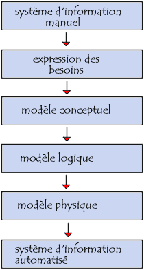

# Modélisation de données

## 1. Créer un dépot git :
- Ouvrir un terminal 
- taper :
```sh
git init
```
Cette commande va initialiser un dépot Git, Git va traquer toutes les modification.

## 2. Utiliser Git :

- Ajouter un fichier a mon dépot git
````sh
git add <fichier>
````
- Sauvegarder mon dépot
````sh
git commit -m "message de commit"
````

## 3. Merise :


Merise est une méthode de modélisation de données. Elle permet de représenter les données d'un système d'information.Merise est un acronyme de : Méthode d'Etude et de Réalisation Informatique pour les Systèmes d'Entrepryse.

#### Présentation générale :
Cette méthode se caracterise par trois points clés : 
- une approche dite systèmique : on transforme les processus de l'entreprise en système d'information 
- une séparation des données et des traitements
- une approche nivelée

    

Le systeme de pilotage : 
- il est composé de l'ensemble des acteurs qui vont **piloter** le système d'information  

le système d'information :
- il est composé de l'ensemble des acteurs qui vont **utiliser** le système d'information

Le système operant : 
- Il est composé de l'ensemble des acteurs qui vont **produire** les données du système d'information

### Séparation des données et des traitements 

La séparation des données et des traitements permet de séparer les données du système d'information et les traitements effectués sur ces données. 
Cette démarche se fait en 3 étapes :
- L'analyse des flux : on annalyse les flux de d'informations entre les acteurs du système d'information et les acteurs du système opérant
- L'étude des documents interne (factures, bon de livraison etc...)